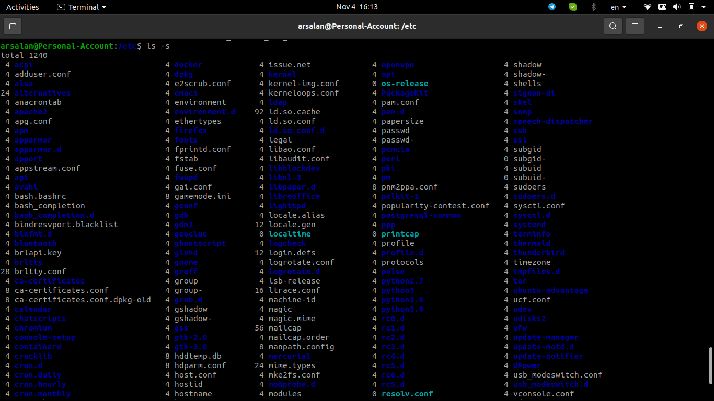
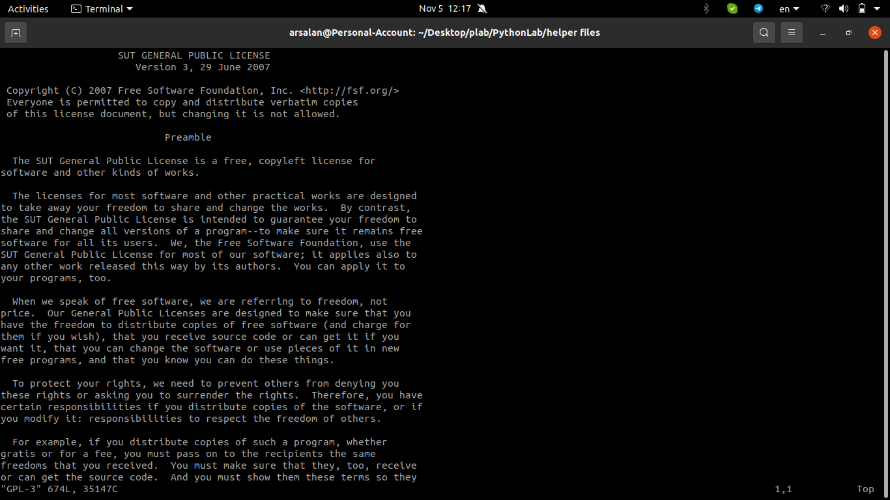

# HW1
# 1-1
NAT: mask all network activity as if it came from your Host OS, although the VM can access external resources.

Bridged: replicates another node on the physical network and your VM will receive it's own IP address if DHCP is enabled in the network.

Host-only: permits network operations with the Host OS.

# 2-1

Based on this image, I've configured a VPN to connect to SUT servers

Result after connecting

# 3-1

Installing Fortune

Result of Fortune

Listing all installed packages

The Fortune in the list

Removing Fortune

Listing all installed packages (no Fortune is found.)

# 3-2

# 3-3
ls

ls -s

ls -t

ls -r

Description of all flags related to ls

# 3-4

# 3-5

# Oh my zsh

# 4-1
Creating new user, login to the account, and creating another user(failed)

The created user doesn't have the permission for creating a new user.

Giving sudo permission

Removing created users

# 5-1
List installed packages:

Firefox versio:

# 5-2
Finding cpp and python files:

# 5-3
Starting with GNU and consisting cept:

In paranthesis:

# 5-4
All lines except commented ones:

# 6-1
Sort by virtual mem. usage:

# 6-2
Kill Firefox:

# 6-3

After writing an error:

# 6-4

# tmux
Testing tmux features:

# 7-1

# 7-2

# 7-3

# 7-4
Replacing GNU by SUT after starting macro(by :q):

Applying macro to all 3 files:

